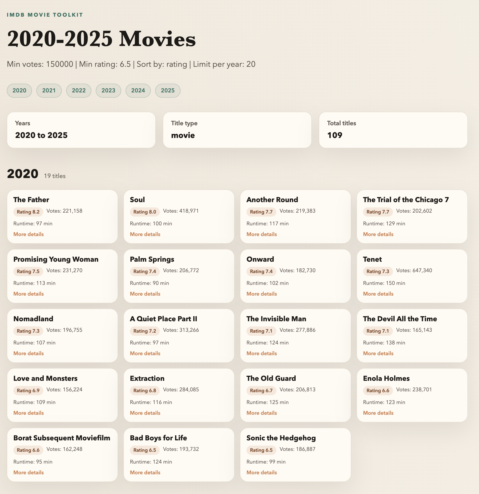

# IMDb Movie Toolkit

This repo contains a script to aggregate IMDb titles into text, CSV, JSON, or HTML outputs. It merges
the `title.basics` and `title.ratings` datasets, filters by title type, year range, votes, ratings,
runtime, and genres, then groups results by year. Use it to generate shareable watchlists by
with customizable filters.

<p align="center">
  
</p>

## Files
- `imdb_movie_toolkit.py` - main script
- `imdb_utils.py` - shared utilities for parsing arguments and reading IMDb TSVs

## Download the IMDb datasets
IMDb hosts the datasets at https://datasets.imdbws.com/. You only need:
- `title.basics.tsv.gz`
- `title.ratings.tsv.gz`

Steps:
1) Open https://datasets.imdbws.com/
2) Download `title.basics.tsv.gz` and `title.ratings.tsv.gz`
3) Keep them in a folder like `~/Downloads/imdb/`

## Example usage
```sh
python3 imdb_movie_toolkit.py \
  --basics-path /path/to/title.basics.tsv.gz \
  --ratings-path /path/to/title.ratings.tsv.gz \
  --start-year 2000 \
  --end-year 2025 \
  --min-votes 150000 \
  --min-rating 6.5 \
  --output samples/movies_by_year.txt
```

Sample output:
```
2025
  F1: The Movie (rating=7.7, votes=238492, genres=Action,Drama,Sport, id=tt16311594)
  Sinners (rating=7.6, votes=305643, genres=Action,Drama,Horror, id=tt31193180)
  Weapons (rating=7.5, votes=225931, genres=Horror,Mystery, id=tt26581740)
  Mission: Impossible - The Final Reckoning (rating=7.2, votes=180984, genres=Action,Adventure,Thriller, id=tt9603208)
  ...
```

The example output is included in `samples/movies_by_year.txt`.

## Help
```
--basics-path PATH       Path to title.basics.tsv or .tsv.gz (required)
--ratings-path PATH      Path to title.ratings.tsv or .tsv.gz (required)
--start-year YEAR        First year to include (default 2000)
--end-year YEAR          Last year to include (default 2025)
--last-n-years N         Override start/end to include most recent N years
--min-votes N            Minimum votes (default 500)
--min-rating N           Minimum rating (default 6.5)
--genre GENRE            Single genre filter (case-insensitive)
--include-genres LIST    Comma-separated genres; match ANY
--exclude-genres LIST    Comma-separated genres; exclude ANY
--min-runtime MIN        Minimum runtime in minutes
--max-runtime MAX        Maximum runtime in minutes
--title-type TYPE        IMDb titleType to include (default movie)
--sort-by MODE           rating | votes | title (default rating)
--limit-per-year N       Max rows per year (default no limit)
--format FORMAT          text | csv | json | html (default text)
--output PATH            Output file (default movies_by_year.txt)
```

## Sample outputs
| Sample | Command |
| --- | --- |
| [`samples/output.html`](samples/output.html) | `python imdb_movie_toolkit.py --basics-path /path/to/title.basics.tsv.gz --ratings-path /path/to/title.ratings.tsv.gz --start-year 2020 --end-year 2020 --min-votes 150000 --min-rating 6.5 --format html --output samples/output.html` |
| [`samples/movies_by_year.txt`](samples/movies_by_year.txt) | `python imdb_movie_toolkit.py --basics-path /path/to/title.basics.tsv.gz --ratings-path /path/to/title.ratings.tsv.gz --start-year 2000 --end-year 2025 --min-votes 150000 --min-rating 6.5 --output samples/movies_by_year.txt` |
| [`samples/sample_limit_sort.txt`](samples/sample_limit_sort.txt) | `python imdb_movie_toolkit.py --basics-path /path/to/title.basics.tsv.gz --ratings-path /path/to/title.ratings.tsv.gz --start-year 2015 --end-year 2020 --min-votes 50000 --min-rating 7.0 --sort-by votes --limit-per-year 10 --output samples/sample_limit_sort.txt` |
| [`samples/sample_tvseries.csv`](samples/sample_tvseries.csv) | `python imdb_movie_toolkit.py --basics-path /path/to/title.basics.tsv.gz --ratings-path /path/to/title.ratings.tsv.gz --start-year 2010 --end-year 2012 --title-type tvSeries --format csv --output samples/sample_tvseries.csv` |
| [`samples/sample_last5.json`](samples/sample_last5.json) | `python imdb_movie_toolkit.py --basics-path /path/to/title.basics.tsv.gz --ratings-path /path/to/title.ratings.tsv.gz --last-n-years 5 --min-votes 100000 --format json --output samples/sample_last5.json` |
| [`samples/sample_genres.txt`](samples/sample_genres.txt) | `python imdb_movie_toolkit.py --basics-path /path/to/title.basics.tsv.gz --ratings-path /path/to/title.ratings.tsv.gz --start-year 2000 --end-year 2005 --include-genres Action,Adventure --exclude-genres Horror --output samples/sample_genres.txt` |
| [`samples/sample_runtime.txt`](samples/sample_runtime.txt) | `python imdb_movie_toolkit.py --basics-path /path/to/title.basics.tsv.gz --ratings-path /path/to/title.ratings.tsv.gz --start-year 1995 --end-year 2000 --min-runtime 90 --max-runtime 120 --output samples/sample_runtime.txt` |
